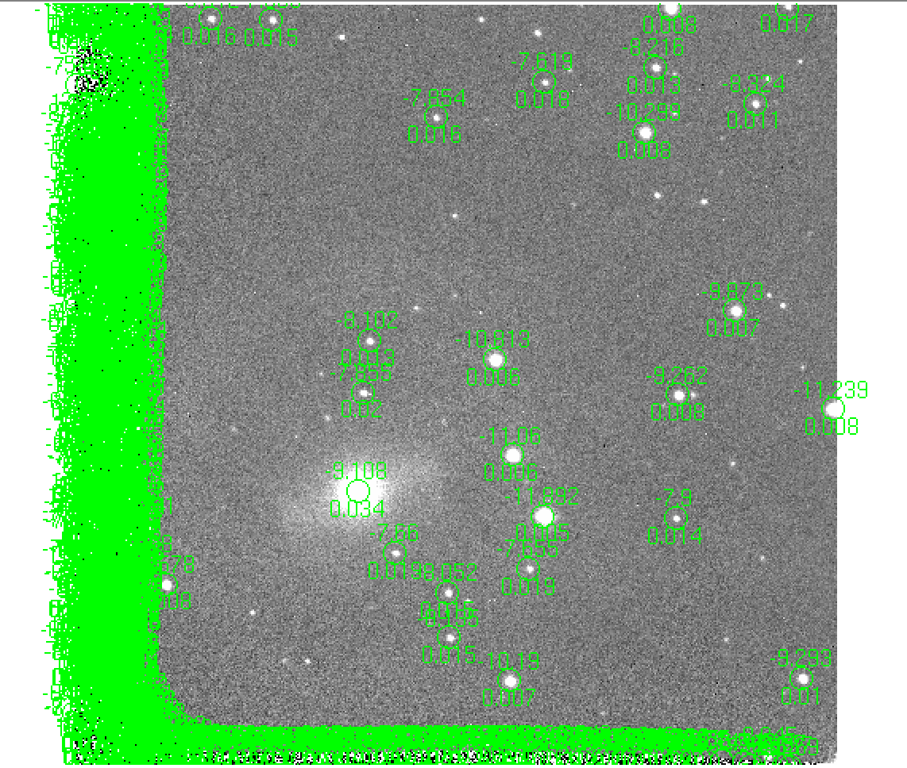

# PmPyEasy

- [x] [External Packages](#etp)
  - [ ] Hotpants
  - [ ] DoPHOT
  - [x] [FITSH](#fitsh)
- [ ] Examples
  - [ ] [Small FOV](#smallfov)
- [ ] [Problems](#problem)

## External Packages 

#### Hotpants

[hotpants](https://github.com/acbecker/hotpants)

#### DoPHOT

#### FITSH 

FITSH is a full-featured, open-source software collection related to astronomical image and data processing written in C. Check out the wiki page of [Fitsh](1) and the [paper](2) describing the package.

Tasks used:

| Program/Task     | Main purpose |
| -----------      | ----------- |
| [fistar](3)      | Detects and characterizes point-like sources from astronomical images.      |
| [grmatch](4)     | Matches lines read from two input files of tabulated data, using various criteria (point matching, coordinate matching or identifier matching).        |
| [grtrans](5)     | Transforms a single coordinate list or derives a best-fit transformation between two coordinate lists. |

[1]: https://fitsh.net/wiki/Main_Page
[2]: https://ui.adsabs.harvard.edu/abs/2012MNRAS.421.1825P/abstract
[3]: https://fitsh.net/wiki/man/fistar
[4]: https://fitsh.net/wiki/man/grmatch
[5]: https://fitsh.net/wiki/man/grtrans

## Examples

#### 1. Small FOV Case 

Situations occur when the images have small FOV and it's not likely to get the WCS solution easily. Then matching between stars in template images and standard stars from external catalog can not be done automatically where manual work required.

Display magnitudes from standard catalog and reference images and then match the common stars.

First, set the pixel scale then display the standards. *sn.standards* will be displayed on template images with (RA, Dec) transformed to image coordinate
> sn.pixscale = (0.375 for ANDICAM CCD)
>
> sn.show_standards_for_wcs_not_available(flt, std_catalog='apass', radius_arcmin=16, rotate_deg=0, brightest_N=None, invert_x=False, invert_y=False, x_mid=None, y_mid=None, display_mags=False, which_dir='raw_image')

To check how well the transformation between sky coordinate to image coordinate, we can load the standard stars to one image with well determined WCS info in header. prepare the image first then use function below:
> sn.load_current_standards_to_ds9_image(img, text1col=None, text2col=None, newds9=True)

Then, get the template mags table. The output format is: id, x, y, mag, magerr

> sn.get_template_reference_mags_flt(flt, which_dir='raw_image', renew_refmags=False)

Next, display the reference stars with labeled ID which aids selecting corresponding stars in input images or from standards stars

> sn.show_reference_stars_with_id_on_template_image_flt()

> sn.standard_calibration_flt_manual_match_method()

##  Problems 

#### hotpants fails for image with low background values
